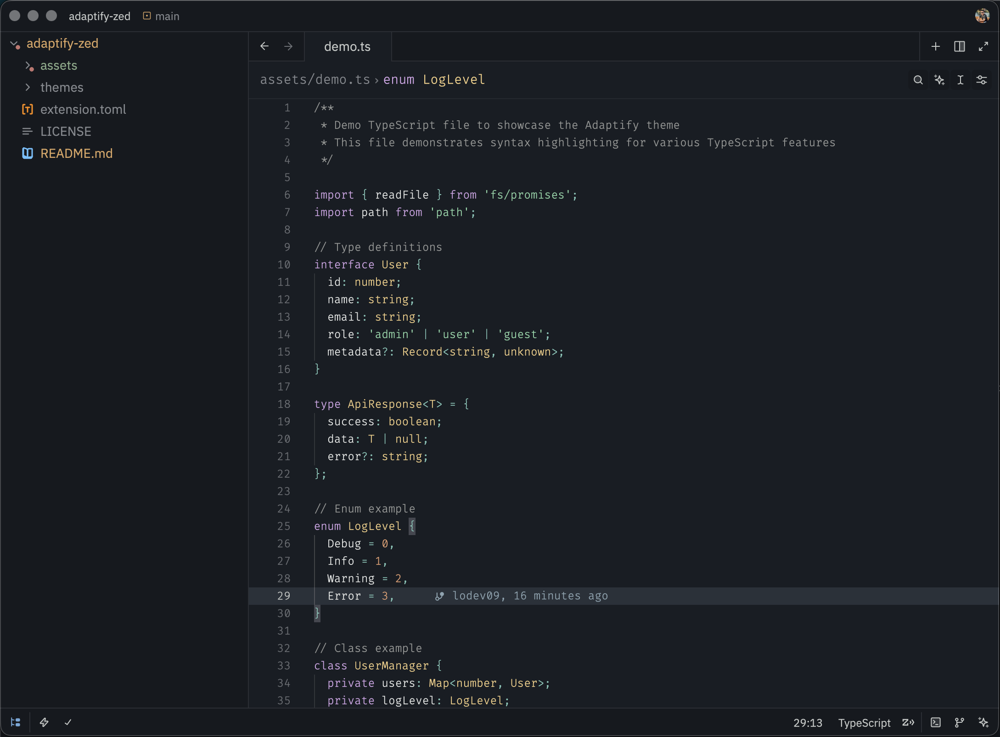
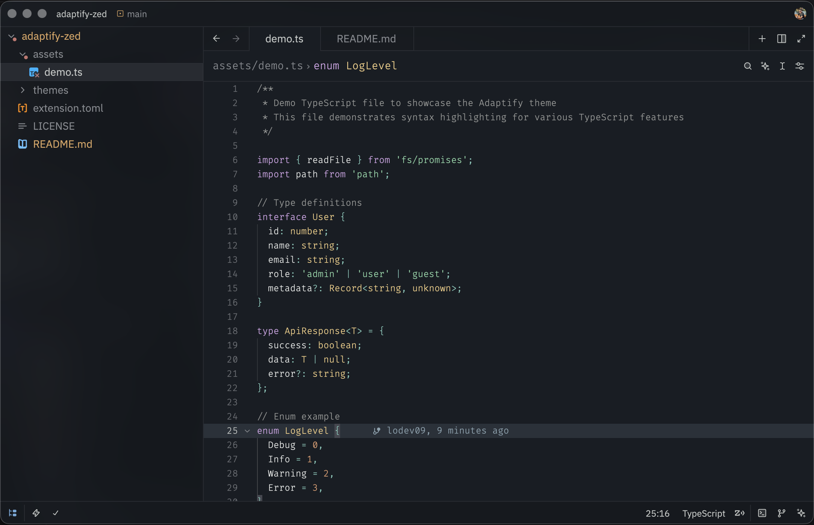
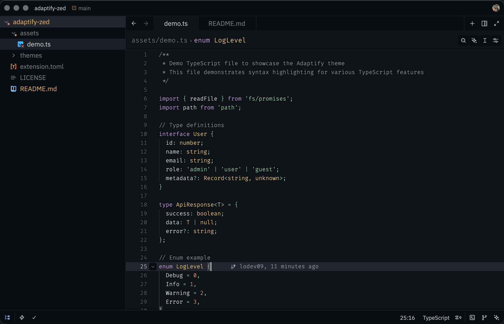
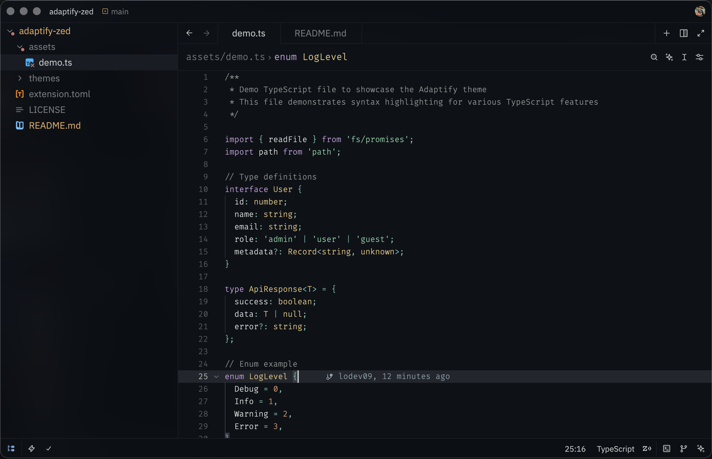

# Adaptify for Zed

A beautiful, adaptive dark theme for Zed editor with multiple variants.

<table>
  <tr>
    <td align="center">
      
       
      <b>Adaptify Dark</b>
    </td>
    <td align="center">
      
       
      <b>Adaptify Dark (Blurred)</b>
    </td>
  </tr>
  <tr>
    <td align="center">
      
       
      <b>Adaptify Darker</b>
    </td>
    <td align="center">
      
       
      <b>Adaptify Darker (Blurred)</b>
    </td>
  </tr>
</table>

## Variants

This theme includes four distinct variants:

- **Adaptify Dark** - The main dark theme with comfortable contrast
- **Adaptify Dark (Blurred)** - Dark theme with translucent backgrounds
- **Adaptify Darker** - A darker variant for those who prefer deeper blacks
- **Adaptify Darker (Blurred)** - Darker variant with translucent backgrounds

## Installation

### Manual Installation

1. Clone this repository or download the theme file
2. Copy the `themes` directory to your Zed configuration folder:
   - macOS: ~/.config/zed/themes/
   - Linux: ~/.config/zed/themes/
   - Windows: %APPDATA%\Zed\themes\
3. Restart Zed
4. Open the command palette and select "Theme Selector"
5. Choose your preferred Adaptify variant

## Color Palette

The theme features a carefully selected color palette designed for extended coding sessions:

- Syntax highlighting optimized for readability
- Subtle UI elements that do not distract
- Comfortable contrast ratios
- Support for various programming languages

## Contributing

Contributions are welcome! Please feel free to submit a Pull Request.

## License

[MIT](LICENSE)

---

Made with ❤️ by [@lodev09](http://linkedin.com/in/lodev09/)
