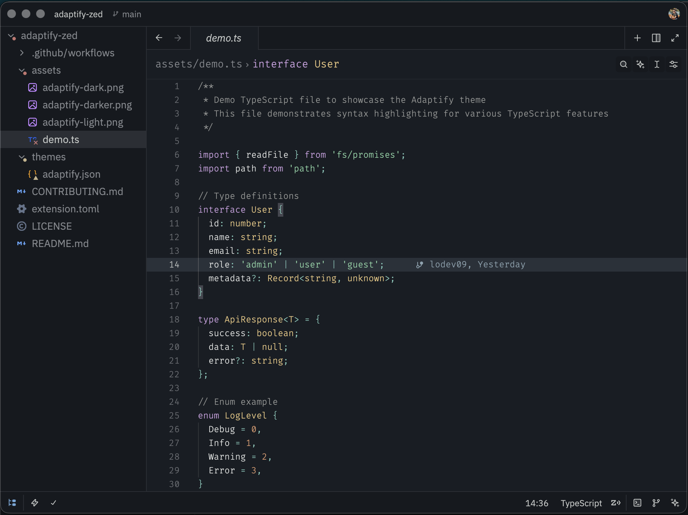
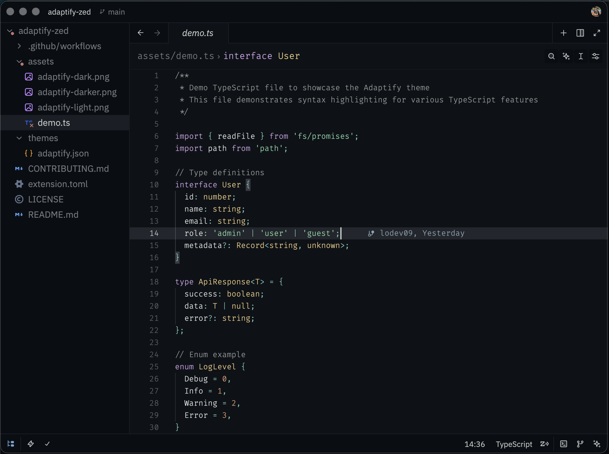

# Adaptify for Zed

A beautiful, adaptive dark theme for Zed editor.

<table>
  <tr>
    <td align="center">
      <b>Dark</b>
    </td>
    <td align="center">
      <b>Darker</b>
    </td>
  </tr>
  <tr>
    <td align="center">
      
    </td>
    <td align="center">
      
    </td>
  </tr>
</table>

## Variants

This theme includes four distinct variants:

- **Adaptify Dark** - The main dark theme with comfortable contrast
- **Adaptify Dark (Blurred)** - Dark theme with translucent backgrounds
- **Adaptify Darker** - A darker variant for those who prefer deeper blacks
- **Adaptify Darker (Blurred)** - Darker variant with translucent backgrounds

## Installation

Adaptify is available on the [Zed Extensions](https://github.com/zed-industries/extensions) repository.

1. Open Zed editor
2. Open the command palette (`cmd+shift+p` on macOS, `ctrl+shift+p` on Linux/Windows)
3. Type "extensions" and select "zed: extensions"
4. Search for "Adaptify"
5. Click "Install"
6. Open the command palette again and select "theme selector: toggle"
7. Choose your preferred Adaptify variant

## Color Palette

The theme features a carefully selected color palette designed for extended coding sessions:

- Syntax highlighting optimized for readability
- Subtle UI elements that do not distract
- Comfortable contrast ratios
- Support for various programming languages

## Contributing

Contributions are welcome!

For development and contribution instructions, see [CONTRIBUTING.md](CONTRIBUTING.md).

## License

[MIT](LICENSE)

---

Made with ❤️ by [@lodev09](http://linkedin.com/in/lodev09/)
